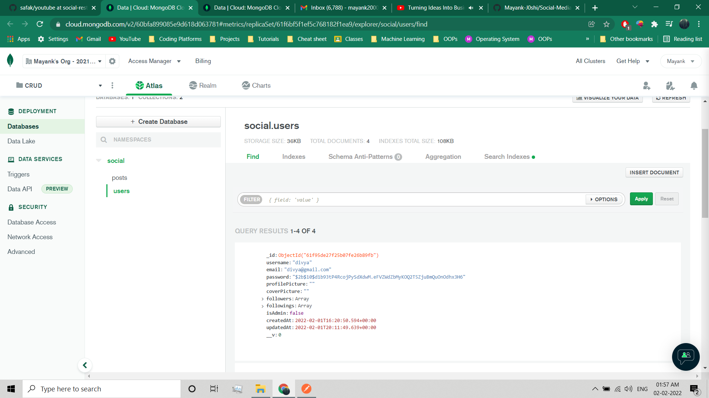

# Social-Media-REST-API
Made a basic crud app using NodeJS, express, mongoDB etc 

## Documentation

1. Install the requirements 
```bash
  npm init
```

2. Install the important packages
```bash
  npm install express mongoose dotenv helmet morgan nodemon
```
3. Run the server
```bash
  npm start
```

## Screens



